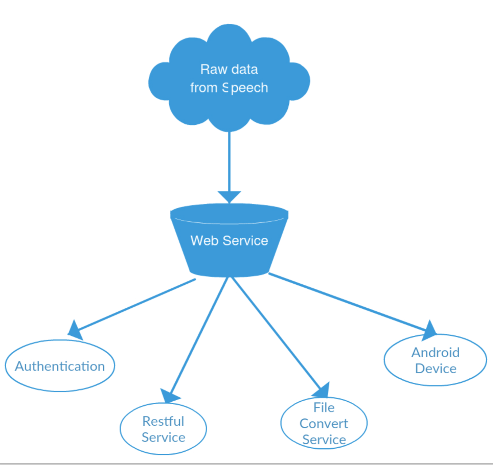

# <center> MarkUp Research Paper<center>

## Background

MarkUp is one of subproject of Project Factor. Project Factor was initiated to build a suite of applications that would
automatically generate text transcripts from IIT course videos using open-source software tools.
Project Factor is divided by three parts:

* Project Convert
* Project Window Pane
* Project MarkUp

## Introduction

For project Convert and project Window Pane, they convert video or audio( such as a speech) into text with timestamp using machine translator, in other words, convert vocal speech into unformatted text using libraries. Project MarkUp is to handle those unstructured text. About project Convert and project Window Pane, please refer to other teammates' research paper. Now let's focus on my project - MarkUp.

MarkUp allows a user to enter a drag and drop application and mark unstructured text via a simple GUI interface.

The Goal of MarkUp:

* Convert unformatted text into formatted text
* Build user Content Management System
* Formatted text can be rendered into a DocBook or HTMLBook format which allows for export to PDF, HTML and even ePub
* PDF and HTML formats can be printed too - making read -time book

## Functionalities of MarkUp

As an independent study for a course in one semester, consider that I only have three months to do this project, I picked up two goals of MarkUp to implement. Functionalities of MarkUp I have implemented is following:

* User authentication
* Account management
* Multi-user synchronous editing capabilities
* All functions performed using Android touch based interface targeting tablets or phone
* All user markup saved and referenced from a common database
* Single user interface which will add, remove and share functionality based in user type(readers, user)

Next, I will explain how I implement MarkUp project. Hope students who want to go on my work pick up my work easily.

## Installation
### Software Install

For software part, there have two parts, backend and front end. So I will introduce installation from these two aspects.
##### Sails.js Version
0.12.0
##### Sails.js Installation

To install the latest stable release with the command-line tool:
```
sudo npm -g install sails
```
On Windows (or Mac OS with Homebrew), you don't need sudo:
```
npm -g install sails
```
You may see some npm WARN deprecated messages when installing Sails. These can be safely ignored. They don’t come from Sails itself, but rather from some packages that Sails relies on--packages which themselves rely on some older modules. The Sails team is committed to keeping the framework secure and stable, and sometimes that (counter-intuitively) requires using some older versions of packages. See this thread for more info about the warnings, and this one for a discussion about updating dependencies in general.

You can go to <http://sailsjs.org/get-started> see more details.

##### Javac -version Version
1.6.0_65
##### Android Studio Installation
Firstly, you go to <http://developer.android.com/sdk/index.html> to download Android Studio, then While the Android Studio download completes, verify which version of the JDK you have: open a command line and type javac -version. If the JDK is not available or the version is lower than 1.8, download the Java SE Development Kit 8.

To install Android Studio on Windows, proceed as follows:
* Launch the .exe file you downloaded.
* Follow the setup wizard to install Android Studio and any necessary SDK tools. I used mac, installation is easy.
On some Windows systems, the launcher script does not find where the JDK is installed. If you encounter this problem, you need to set an environment variable indicating the correct location. Select Start menu > Computer > System Properties > Advanced System Properties. Then open Advanced tab > Environment Variables and add a new system variable JAVA_HOME that points to your JDK folder, for example C:\Program Files\Java\jdk1.8.0_77.

You can go to <http://developer.android.com/sdk/installing/index.html> see more android studio installation details.

##### Android Studio Configuration

This is my build.gradle file. There have compileSdk, buildTools and dependencies information.

```
apply plugin: 'com.android.application'
android {
    compileSdkVersion 23
    buildToolsVersion "23.0.1"
    useLibrary 'org.apache.http.legacy'

    defaultConfig {
        applicationId "com.example.miaodonghan.markupproject_01"
        minSdkVersion 15
        targetSdkVersion 23
        versionCode 1
        versionName "1.0"
    }
    buildTypes {
        release {
            minifyEnabled false
            proguardFiles getDefaultProguardFile('proguard-android.txt'), 'proguard-rules.pro'
        }
    }
}

dependencies {
    compile fileTree(dir: 'libs', include: ['*.jar'])
    testCompile 'junit:junit:4.12'
    compile 'com.android.support:appcompat-v7:23.1.1'
    compile 'us.feras.mdv:markdownview:1.1.0'
}
```

### Hardware Tools

You can user any android platform version higher than android 4.0 API 15. I use Nexus 7 API 22.

### Other Tools - Postman
I always use Postman to debug backend, which takes less time than debug using android studio emulator or android device.

##### Install Postman
Postman now offers a Mac App. Unlike the Chrome app, the Mac app is packaged with add-ons that make request capturing and cookie handling seamless.

To install go to <https://www.getpostman.com/apps>, and click 'Get Mac App'.The download should take a few minutes, depending on your internet connection. Once you've downloaded the app, you can install and launch Postman like any other Mac app.
## Architecture of MarkUp
After gathering information or requirements of MarkUp and understand MarkUp, I figured out Functionality of MarkUp and main service of MarkUp. Architechure of MarkUp is below:


<center> figure 2<center>


Raw data from Speech in above graph is that unstructured text that is converted from video or audio using machine translator.

Web Service is serve-side, which aims at storing data and handling logic relationships between models. MarkUp web service mains includes four service:

* Authentication
* Restful service
* File convert service
* Android Device

I will simply explain each service next.

Authentication is a process in which the credentials provided are compared to those on file in a database of authorized users' information on a local operating system or within an authentication server. If the credentials match, the process is completed and the user is granted authorization for access.

Restful Service is


  * Authentication

  Authentication is a process in which the credentials provided are compared to those on file in a database of authorized users' information on a local operating system or within an authentication server. If the credentials match, the process is completed and the user is granted authorization for access.
  * RESTful service
  REST stands for Representational State Transfer, which is an architecture style for networked hypermedia applications. It is primarily used to build Web service that are lightweight, maintainable and scalable. A service based on REST is called a RESTful service.

  A restful API is an application program interface that uses HTTP requests to GET,PUT,POST and DELETE data.

  * File Convert Service
  File Convert Service is to covert markdown format to other document format, such as PDF, ePub, by using some libraries(panddoc).

  * Android Device

  Android Device is serve as an GUI interface. After server processed data, android device is used to render or display data in a great UI.

## Flow chart of MarkUp

According to MarkUp Functionalities I implemented, I design a flow chart below to show MarkUp app clearly.


<center> figure 2<center>

Before introduce flow-chart above, let's assume that we are using IIT blackboard online video database now. For every class video, we convert speech into text, then those unstructured text translated by machine translator is put in database. Here, I defined every video text as document. In MarkUp, my idea is to let user edit unstructured text to become user own modified document. So let's call those documents translated from machine translator as original version of document, lets's call those document modified by users as modified version of document. If one video document is modified by Multi-users, these users create many versions of this document. So one document may have lots of versions.


For every  As above flow-chart graph shows, there have three user type, Admin, User and Reader.

Admin is in charge of manipulating database that store unstructured data, in other words, admin is to add document into database. In IIT blackboard online video, after machine translator finish translating, admin has to check if there have new document and then adds new translated documents into the database that stores unstructured data. Maybe we can implement functionality to add new document into database automatically. In flow-chart, you can see, admin is in charge of managing document. Admin can do:

* Admin can add new documents to database
* Admin has right to decide if new documents could be put in database
* Admin can update/delete documents in database

In IIT example, user is student. User needs to register and login MarkUp app to enter MarkUp
app. Things Users could do in MarkUp app are in below:
* User can access all documents and all shared versions in database
* User can edit any version they want to  
* User can create new version by saving edit exist versions of document
* User can access his own documents and all shared versions in his profile.
* User can share/unshare their own versions in their profiles
* User can delete their own versions in their profiles

Shared versions are versions that users shared their own versions of documents in their profile. After user shares their own version for one document, all readers and other users can access this shared version of this document. If user doesn't share their own version of one document, all readers and other users cannot access your unshared version of one document. One more thing, in model design, all versions of document state is unshared by default.

For readers, reader only can access all document, their original version of document and their shared version of document. In addition, readers can read and edit versions of documents. However, readers cannot save versions of documents that they edit unless they register an account and login. Readers could do:
* Readers can access all documents and all shared versions in database
* Reader can edit any versions of documents they want to, but cannot save versions they edit

## Backend Design

After discussing MarkUp architecture and whole flow-chart, now let's see how to implement those functionality of different user-type.

I used sails.js as web framework in MarkUp backend. It is designed to emulate the familiar MVC pattern of frameworks like Ruby on Rails. But in his project, I used android device to be my view part. Here, I will introduce models and controller, explain android part in frontend section.

#### Model Design

According to explanation above,it is easy to know that, at least, there should
have a model user and a model document in content management system because it is user
to manipulate data(document). In addition, I also designed a version model. The reason I did this is to solve the problem that Multi-user could edit same document in the same time in another way. At the same time, I also implement version control functionality using different timestamp in the view of user.
In order to describe model and their relationships clearly, I used E-R diagram to show attributes of models and relationship between different model.

An ER model is composed of entity types and specifies relationships that can exist between instances of those entity types. ER model is an abstract data model that defines a data or information structure that can be implemented in a database, typically a relational database. Rectangle represents entity, isometric square represents relation between models.
Ellipse represents attributes of model.

<center><center>
<center> figure 3<center>

As figure 3 shows, there have three models, document, version and user. Association(relationship) between models is following:

* Document : Version = 1: many
* User : Version = 1 : many
* User : Document = many : many

In addition to these three basic model, there is one more model, auth. Auth is to check if authorized user is logged or use type is user or reader. E-R diagram is showed below.

<center><center>
<center> figure 4<center>

For model code in MarkUp, you can find corresponding code in path  MarkUP_WebSerivce/webservice/api/models.


#### Router Design

According to functionalities of MarkUp, I designed URL that users enter in the browser. These URLs map to some specific physical file mapped to a directory on the web server which we call the virtual directory. When user sends requests, controller in backend processes corresponding requests via URL. The figure 5 shows the logic clearly.

<center><center>

<center> figure 5<center>

I listed all URLs I design in MarkUp below.

###### Document:
```
'post   /api/doc':     'DocumentController.post',
'get    /api/doc':     'DocumentController.list',
'put    /api/doc/:docid': 'DocumentController.put',
'delete /api/doc/:docid': 'DocumentController.delete',
```
###### Version:
```
'get    /api/doc/:docid/version': 'VersionController.list',
'get    /api/doc/:docid/version/:vid': 'VersionController.get',
'post   /api/doc/:docid/version': 'VersionController.post',
'put    /api/doc/:docid/version/:vid': 'VersionController.put',
'delete /api/doc/:docid/version/:vid': 'VersionController.delete',
```
###### User Authentication:
 ```
'post   /api/auth/login': 'AuthController.login',
'post   /api/auth/logout': 'AuthController.logout',
'post   /api/auth/register': 'AuthController.register',
```
###### User_document:
```
'get    /api/:userid/docs':     'DocumentController.list_user',
```
###### User_version:
 ```
'get    /api/:userid/docs/:docid/version': 'VersionController.list_user',
'get    /api/:userid/docs/:docid/version/:vid': 'VersionController.get_user',
'post   /api/:userid/docs/:docid/version': 'VersionController.post_user',
'delete /api/:userid/docs/:docid/version/:vid': 'VersionController.delete_user',
 ```

 For URLs above, I explain them in order that you can understand well.
 First part, document is just comment, which represents these URLS in this part
 are handle document manipulation. So on so forth for next three parts.

 Now, let me explain my URL, for example:

 ```
 'get    /api/doc':     'DocumentController.list',
 ```
 For this URL, get is restful API, /api/doc is url user enters in the browser,
 DocumentController.list is list method in DocumentController. In other words,
 when user enters ip:port/api/doc in browser, backend will find list function in
 DocumentController to do login operations. Get is Restful API type of list function.

 ```
 'get    /api/doc/:docid/version/:vid': 'VersionController.get',
 ```
 For this more complicated URL, in addition to /api/doc, there have :docid and :vid. :docid and :vid are parameters that are passed into get function in VersionController in order to do some logic operations.

#### Controller Design
Controller is responsible for processing incoming requests, handling input, saving data and sending
a response to send back to the client. In sails.js, web server
will normally map incoming URL requests directly to files on the server. In controller class, processing
incoming requests will map corresponding RESTful API method to processing login operations.

If you want to see controller code in MarkUp, you can find corresponding code in path  MarkUP_WebSerivce/webservice/api/controllers.

#### Authentication
For authentication, I used WaterLock to check if user log in or not. WaterLock users
the req.session express object to hold various information about user. Specific implementation
is in MarkUP_WebSerivce. Here, I just want to describe logic about how to implement authentication.
Without authentication, after user sends request from browser, URL will map restful API method in corresponding controller,
The way I add authentication functionality is that incoming requests from user have to be checked by WaterLock
before incoming requests arrive at controller. The logic is showed in figure 6.

<center><center>

<center> figure 5<center>

If there have token in client-side, request will go to controller to execute corresponding
operations, otherwise, user has to login first. If user logs in successfully, server will sent token to client-side
, client-side will store token in browser or other user computer and then send request again to server, otherwise,
user has to register and back to login. In client-side, it is different between usual authentication method and WaterLock,
WaterLock method puts token in header, in HTTP requests, you could implement it(add token to header) by set perperty
About how to set bar to check in server, I will explain it via code.  

The code section below is part of authentication in backend, you could find it in MarkUP_WebSerivce/config/policies.
This section means, if you want to access post_user, put_user, delete_user, get_user and list_user methods in VersionController,
you have to do authentication. It is same with DocumentController part.

However, you can see, there are only part of methods in controllers to check if user logged in or not.
Why I don't set all methods in controllers to do authentication? Reason is simple, for reader, they can
access parts of information in MarkUp without logging in.

```
VersionController: {
  post_user: ['hasJsonWebToken'],
  put_user:['hasJsonWebToken'],
  delete_user: ['hasJsonWebToken'],
  get_user:['hasJsonWebToken'],
  list_user:['hasJsonWebToken'],
},

DocumentController: {
  get_user:['hasJsonWebToken'],
  list_user:['hasJsonWebToken'],
},
```

## Front-end Design


## Front-end Design
I mentioned in previous section, android device is viewed as view part in MVC framework,
so android development means front-end development. In this section, I won't introduce so much about
how to create layout and Activity

#### Layout and Activity

When you make an Android Application, the first thing you will do is create an activity.
These are where all the action happens, because they are where all action happens,
because they are the screens that allow the user to interact with your app.

Another incredibly important part of building an Android application is creating a layout that the users of the
application interact with.Android Studio offers an advanced layout editor that allows you to drag-and-drop
widgets into your layout and preview your layout while editing the XML.
Within the layout editor, you can switch between the Text view, where you edit
the XML file as text, and the Design view. Just click the appropriate tab at the
bottom of the window to display the desired editor. If you want to know more, you
could go to <http://developer.android.com/sdk/installing/studio-layout.html>.

Here, I won't say a lot of details about how to create an android application. If you have
taken ITMD555, it is easy to understand MarkUp.

#### AsyncTask

AsyncTask is an abstract class provided by Android which helps us to use UI thread properly.
This class allows us to perform background operations and show its result on the UI thread
without having to manipulate threads.

Android implements single thread model and whenever an application is launched,
a thread is created. Assuming we are doing network operation on a button click in our application.
On button click a request would be made to the server and response will be awaited. Due to single
thread model of android, till the time response is awaited our screen is non-responsive. So we should avoid
performing long running operations on the UI thread. This includes
file and network access. To overcome this, we can create new thread and implement run method
to perform this network call, so UI remains responsive.

But since Android follows single thread model and Android UI toolkit is not thread safe,
so if there is a need to make some change to the UI based on the result of the operations
performed, then this approach may lead some issues. So the android framework has given
a very good patten which is enveloped into AsyncTask.

In MarkUp, there is a need to communicate with the server and get data from it, so
I used AsyncTask to perform many times long running operations on the UI thread, otherwise,
user experience will be very bad. For every AsyncTask in MarkUp app, it will map route I designed.

AsyncTask has four steps:
* doInBackground: Code performing long running operations goes in this method. when
onclick method is executed in click of button, it calls execute method which accepts parameters
and automatically calls doInBackground method with the parameters passed.
* onPostExecute: This method is called after doInBackground method completes processing. Result
form doInBackground is passed to this method.
* onPreExecute: This method is called before doInBackground method is called.
* onPrograssUpdate: This method is invoke by calling publish progress anytime from doInBackground
call this method.


#### SharedPreference

Actually, android provides several options for user to save persistent application data.
* SharedProference - store private primitive data in key-value pairs
* Internal Storage - store private data on the device memory
* External Storage - store public data on the shared external storage
* SQLite Database - store structured data in a private database
* Network Connection - Store data on the web with your own network server

Considered this application specific needs, I choose sharedProference because MarkUp
only needs to save small collection of key-values. For more details, please access to
<http://www.compiletimeerror.com/2015/02/android-shared-preferences-example-and-tutorial.html#.Vy0QpKMrJnY>

#### MarkDown libraries

The important part in this app is converting unstructured text into formatted text. I used
MarkDownView library to implement this functionality.This library is very well and easy to learn, let's see what's MarkDownView. MarkdownView (Markdown For Android) is an Android library that helps you display Markdown text or files (local/remote) as formmated HTML, and style the output using CSS.
The MarkdownView itself extends Android webview and adds the necessary logic to parse Markdown (using MarkdownJ) and display the output HTML on the view.  

## Achievement

## Challenge

## Work in the future
## Conclusion
